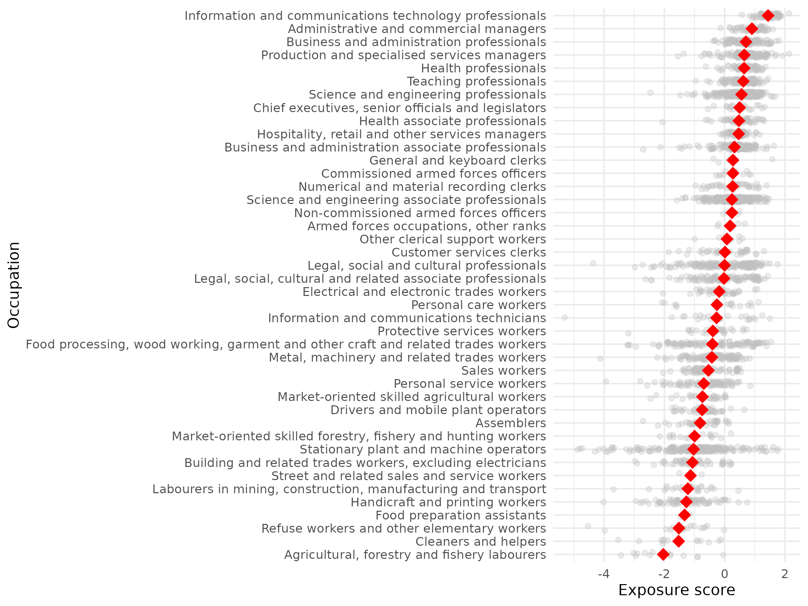

Process:

# Occupational Exposure to Disruption from AI Products

This project aims to derive a measure of the degree to which each occupation is exposed to disruption by Artificial Intelligence. To do so, I use public press release data and a fine-tuned BERT-style classifier to identify new AI product launches or adoptions. Next, I use a Large Language Model (o3-mini) to extract the specific capabilities of each AI product. I compare these capabilities to a list of job relevant skills compiled by ESCO in terms of cosine similarity, and calculate a occupation-level exposure score by avaraging over the job skill - AI capability similarity of all job skills related to each occupation.

The main results are in `results/occupational_exposure_to_ai_products/`. The file `scored_esco_occupations.csv` contains occupational exposure scores for all individual occupations in the ESCO database. I also provide results aggregated to the ESCO 4-digit, 3-digit, 2-digit, or 1-digit level (which are compatible with the corresponding levels of the ISCO classification). Finally, the file `scored_soc_equivalent_occupations.csv` contains occupational exposure scores for occupations in O\*NET, obtained by converting the ESCO scores using the ESCO-O\*NET crosswalk provided by ESCO.

The plot below summarizes the main findings, which put knowledge-heavy and highly-skilled occupation at the top in terms of their exposure to AI, while occupation requiring physical labor are towards the bottom.

Occupation with high exposure scores tend to be highly paid and with low unemployment rates, suggesting that AI product innovation may be targeted towards tasks for which the required labor is relatively scarce and expensive.

The exposure score is decomposed in two components - *AI Product Automation* and *AI Product Augmentation*. These components are based on the messaging language used in the press release announcing the product - e.g. whether the product is described as replacing human labor or as assisting human labor. In general, higher wage and lower unemployment occupations are relatively more exposed to AI products described as augmenting human labor, while automation exposure is more evenly distributed across the wage and unemployment spectrum.

The full details about the method and the results, as well as connections to existing literature, as described in the file `main_text.pdf`. Please keep in mind, that this project is a work in progress, and it may undergo slight or even significant changes prior to publication.

## Reproducability

1. Run `py/scrape_releases.py` - populates folders `data/links` and `data/articles`. The `data/` directory is not tracked by git due to its large size.
2. Run `py/filter_press_release_by_keyword.py` - creates `results/press_releases/filtered_press_releases.csv` that contains only press releases that contain certain keywords related to AI (overwrites)
2. Run `py/find_relevant_releases_finetune.py` - creates `results/press_releases/relevant_press_releases.csv` by first finetuning a DistilBERT model on a small labeled dataset of relevant and non-relevant press releases, and then using the model to score the press releases in `data/filtered_press_releases.csv` (appends if it exists)
3. Run `py/extract_product_capabilities.py` - creates `results/press_releases/processed_press_releases.csv` (appends if it exists) and `results/press_releases/ai_product_press_releases.csv`. Executes GPT queries.
4. Run `py/match_capabilities_to_skills.py` - creates `results/scored_esco_skills.csv` (overwrites)
5. Run `py/scrape_cedefop.py` - creates `data/skills_intelligence_data.csv` (overwrites)
6. Run `R/aggregate_skills_to_occupations.R` - creates `results/scored_esco_occuations.csv`
7. Run `R/match_to_prior_work.R` - creates `results/scored_esco_occupations_matched.csv`
8. Run `R/join_to_occupation_statistics.R` - creates `results/scored_esco_occupations_matched.csv`